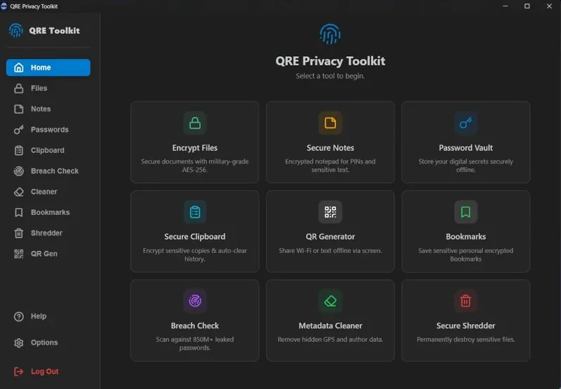

# QRE Locker (v2.2)

**A Modern, Quantum-Resistant File Encryption Tool.**

QRE Locker is a cross-platform desktop application designed to secure your data against both modern cyber threats and future quantum computing attacks. It combines the speed of **AES-256-GCM** with the post-quantum security of **ML-KEM-1024 (Kyber)** in a user-friendly, local-first interface.



## 🚀 What's New in v2.2?

We have completely re-engineered the application from a Python prototype to a native Rust executable.

*   **⚡ Native Performance:** Rewritten in **Rust** for memory safety and blazing fast speeds.
*   **📂 Directory Support:** Drag and drop entire folders to compress and encrypt them automatically.
*   **🗄️ Local Keychain:** No more "Stateless" headaches. Set a Master Password once; the app handles key management securely on your device.
*   **🔑 Multi-Factor Encryption:** Optionally use a **Keyfile** (any image, song, or document) as a second authentication factor.
*   **🎲 Paranoid Mode:** Inject hardware-based entropy (mouse movements/system timing) into the key generation process for maximum unpredictability.
*   **🛡️ Robust Recovery:** Built-in "Emergency Recovery Code" system in case you forget your password.

## 🛡️ Security Architecture

QRE Locker employs a **Hybrid Cryptographic Scheme** ensuring defense-in-depth:

1.  **Session Security:** Every time you lock a file, a unique, ephemeral **AES-256-GCM** key and **ML-KEM-1024** keypair are generated.
2.  **Hybrid Layering:** The file content is compressed (Zstd) and encrypted with AES-256. The AES key is then encapsulated by the Kyber public key.
3.  **Key Wrapping:** The Kyber Private Key (needed to unlock the file) is encrypted using your **Master Key**.
4.  **Master Key Derivation:** Your Master Key is derived from your Passphrase (and optional Keyfile) using **Argon2id**, the winner of the Password Hashing Competition.
5.  **Memory Safety:** Critical keys are marked with `Zeroize`, ensuring they are wiped from RAM immediately after use.

### The Tech Stack
*   **Frontend:** React (TypeScript) + Vite
*   **Backend:** Rust (Tauri v2)
*   **Crypto Libraries:** `pqcrypto-kyber`, `aes-gcm`, `argon2`, `sha2`
*   **Compression:** `zstd`

## 📦 Installation

Download the latest installer for your operating system from the [Releases Page](https://github.com/powergr/quantum-locker/releases).

*   **Windows:** `.exe` or `.msi`
*   **macOS:** `.dmg`
*   **Linux:** `.deb` or `.AppImage`

> **Note:** As this is open-source software, the installer is currently self-signed. You may need to click "More Info" -> "Run Anyway" if Windows SmartScreen prompts you.

## 📖 User Guide

### 1. Setup
On first launch, you will be asked to create a **Master Password**.
*   **Recovery Code:** You will be shown a code like `QRE-A1B2-C3D4...`. **Save this.** It is the *only* way to recover your data if you forget your password.

### 2. Locking Files
1.  **Select Files:** Drag and drop files or folders into the app, or use the "Select Files" button.
2.  **Options:**
    *   **Advanced > Keyfile:** Select a secret file (e.g., a photo) to act as a physical key.
    *   **Advanced > Paranoid Mode:** Enables entropy injection.
3.  Click **Lock**.
4.  Original files remain; new `.qre` encrypted files are created next to them.

### 3. Unlocking Files
1.  Select the `.qre` files.
2.  If you used a Keyfile to lock them, ensure it is selected in the **Advanced** menu.
3.  Click **Unlock**.
4.  The app validates integrity and restores the original files. If a file with the same name exists, it will smart-rename the output (e.g., `document (1).pdf`).

### 4. Management
*   **Change Password:** Update your credentials without re-encrypting your files (re-wraps the Master Key).
*   **Reset 2FA:** If you lose your Recovery Code, generate a new one via the Options menu.

## 🛠️ Development Setup

If you want to build from source or contribute:

### Prerequisites
*   [Node.js](https://nodejs.org/) (v18+)
*   [Rust](https://www.rust-lang.org/) (latest stable)
*   **Windows:** C++ Build Tools (via Visual Studio Installer)
*   **Linux:** `libwebkit2gtk-4.1-dev`, `build-essential`, `curl`, `wget`, `file`, `libssl-dev`, `libgtk-3-dev`, `libayatana-appindicator3-dev`, `librsvg2-dev`

### Setup & Run
1.  Clone the repo:
    ```bash
    git clone https://github.com/powergr/quantum-locker.git
    cd qre-gui
    ```
2.  Install frontend dependencies:
    ```bash
    npm install
    ```
3.  Run in development mode:
    ```bash
    npm run tauri dev
    ```

### Building for Production
To create the optimized executable/installer:
```bash
npm run tauri build

The executable will be located in src-tauri/target/release/bundle/.

"Note: Because this is open-source software, the executable is not digitally signed. Windows Defender SmartScreen may trigger a warning. Click 'More Info' -> 'Run Anyway' to install."

📄 License
MIT License. See LICENSE (LICENSE) file.
