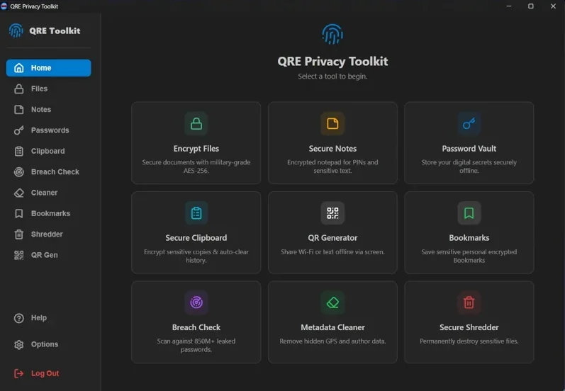

# QRE Privacy Toolkit

**The Local-First Swiss Army Knife for Digital Privacy.**

[](https://github.com/powergr/qre-privacy-toolkit/actions/workflows/build.yml)


[](https://deps.rs/repo/github/powergr/qre-privacy-toolkit?path=src-tauri)


QRE Toolkit is a secure, cross-platform application designed to handle your sensitive data without relying on the cloud. It runs natively on **Windows, macOS, Linux, and Android**.

**[📥 Download the Latest Release](https://github.com/powergr/qre-privacy-toolkit/releases)**

[](https://github.com/sponsors/powergr)

---



---

## 🛠️ The Toolkit

QRE Toolkit combines 12 essential privacy tools into one secure application:

### **1. 🔐 File Encryption**

Secure any file—photos, tax documents, 50GB video backups—using military-grade **AES-256-GCM**.

**Unlimited Size:** Powered by a custom **Rust Streaming Engine**, you can encrypt files of any size without using up your RAM.

**Smart Compression:** Automatically compresses documents while skipping media files.

**Cross-Platform:** Lock a file on your PC, unlock it on your Android phone.

### **2. 🔑 Password Vault**

A secure, offline database for your logins.

**Zero-Knowledge:** Your secrets are encrypted with your Master Key inside your local keychain.

**Generators:** Built-in strong password generator and strength meter.

### **3. 📝 Secure Notes**

An encrypted notepad for sensitive text that isn't just a password.

- Store recovery seeds, Wi-Fi codes, or private journals.

- Data is encrypted at rest and only decrypted in memory when you view it.

### **4. 🔖 Private Bookmarks**

Save your sensitive links (Bank logins, Medical portals, Crypto exchanges) in an encrypted vault.

**No Tracking:** Unlike browser bookmarks, these are never synced to Google/Apple/Mozilla servers.

**Encrypted Storage:** URLs are encrypted on disk, so forensic tools cannot see your browsing history.

### **5. 📋 Secure Clipboard**

The clipboard is a common security leak.

**Secure Paste:** Grabs text from your clipboard, encrypts it into a secure history, and **wipes** the OS clipboard immediately.

**Auto-Cleanup:** Automatically deletes history entries after a set time (e.g., 24 hours).

### **6. 🧹 Metadata Cleaner**

Photos and documents contain hidden data (Exif) that can reveal your location and identity.

**Scrub:** Remove GPS coordinates, Camera models, Authors, and Edit history from Images (JPG/PNG), PDFs, and Office Docs.

**Batch:** Drag & drop multiple files or folders to clean them instantly.

### **7. ✅ Integrity Checker**

Verify that files you download (like crypto wallets, Linux ISOs, or installers) are genuine and haven't been tampered with by hackers.

**Multi-Hash:** Calculates SHA-256, SHA-1, and MD5 simultaneously.

**Auto-Compare:** Paste the official hash from the developer's website, and QRE will instantly highlight if it matches or fails.

### **8. 📡 Privacy Check**

Check if your password has appeared in known data leaks (850M+ records).

**Privacy Preserving:** Uses **k-Anonymity**. We send only the first 5 characters of the hash to the API. Your password is **never** sent to any server.

### **9. 🗑️ System Clean**

Remove temporary files, caches, and usage history to free up space and improve privacy.

**Targets:** Clears browser caches (Chrome, Edge, Brave), Windows Temp, and Recent Documents list.

**Privacy:** Only deletes cache/temp files. It does NOT delete saved passwords or cookies.

Available on Desktop versions only.

### **10. 🔳 Secure QR Generator**

Share sensitive data (Wi-Fi passwords, Crypto addresses) with mobile devices without sending it over the internet.

**Air-Gapped:** Data stays on your screen. The recipient scans it with their camera.

**Offline:** No API calls. The QR is generated locally in Rust.

### **11. 🗑️ Secure Shredder (Desktop)**

When you delete a file, the data remains on your disk. The Shredder overwrites your files with random noise (DoD Standard 3-Pass) before deleting them.

_(Note: On Android, this performs a standard permanent delete due to hardware limitations)._

### **12. 🔎 File Analyzer**

A security tool designed to detect malicious files hiding behind fake extensions (e.g., `salary.pdf.exe`).

**Deep Scan:** Analyzes file headers (Magic Numbers) to determine the 'true' file type, ignoring the extension.

**Malware Detection:** Instantly flags executable binaries that are masquerading as Documents, Images, or Archives.

**Smart Filtering:** Intelligently whitelists common safe mismatches (e.g., `.docx` is technically a `.zip`) to reduce false positives.

---

## 🛡️ Security Architecture

**Key Derivation:** Argon2id (Resistant to GPU brute-force).

**Paranoid Mode:** Mixes true physical entropy (mouse/touch timing jitter) with the OS's cryptographic generator. This mathematically immunizes your encryption against theoretical hardware RNG backdoors.

**Panic Button:** `Ctrl+Shift+Q` instantly kills the app and wipes memory (Desktop).

**Auto-Lock:** Sessions timeout after 15 minutes of inactivity.

---

## 🚀 Getting Started

1. **Create a Vault:** Set a strong Master Password.
2. **Save your Recovery Code:** This is the _only_ way to restore access if you forget your password.
3. **Start using the tools:** Select a tool from the Home screen or Sidebar.

---

## 📦 Building from Source

```bash
# 1. Install Dependencies
npm install

# 2. Run in Dev Mode
npm run tauri dev

# 3. Build for Release
npm run tauri build
```

---

## ✴️ Auto Update System

Please read the file [QRE Auto Update System](AUTO_UPDATE_README.md)

---

## ⚠️ Important Security Notice

QRE Toolkit follows a **Zero-Knowledge** architecture.
If you lose your **Master Password** AND your **Recovery Code**, your data is mathematically inaccessible. There is no "Password Reset" button because there is no server.

**Backup your `keychain.json` file and store your Recovery Code safely.**

---

## 🛡️ Download Security

### Windows SmartScreen Warning

You may see "Windows protected your PC" when running QRE Privacy Toolkit.

**Why this happens:**

- QRE Privacy Toolkit is not yet code-signed (we're working on it)
- Microsoft requires paid certificates ($200-500/year)
- As an open-source project, we're applying for free signing

**How to verify your download is safe:**

1. Check SHA-256 hash matches release page
2. Review source code (fully open source)
3. Scan with VirusTotal

**To run anyway:**

1. Click "More info"
2. Click "Run anyway"

We're working with SignPath.io to get free code signing for open-source
projects. Once approved, future releases will be signed.

### Why Trust QRE Locker?

- ✓ Fully open source (MIT license)
- ✓ Active development on GitHub

## 🍎 macOS Installation Note

If the app fails to open, shows "App is damaged", or crashes immediately, it is because the app is not notarized by Apple.

**To fix this:**

1. Drag **QRE Privacy Toolkit** into your **Applications** folder.
2. Open the **Terminal** app.
3. Run the following command:

   ```bash
   sudo xattr -cr /Applications/"QRE Privacy Toolkit.app"
   ```

4. Open the app normally.

---

## ✅ Tests

There are 2 test suits.

For the Rust backend run

```bash
cd /src-tauri
cargo test
```

- 235 tests passed from 235 total

For the frontend run

```bash
npm test
```

- 170 tests passed from 170 total

---

**License:** MIT

---

**Copyright:** © 2026 Project QRE
