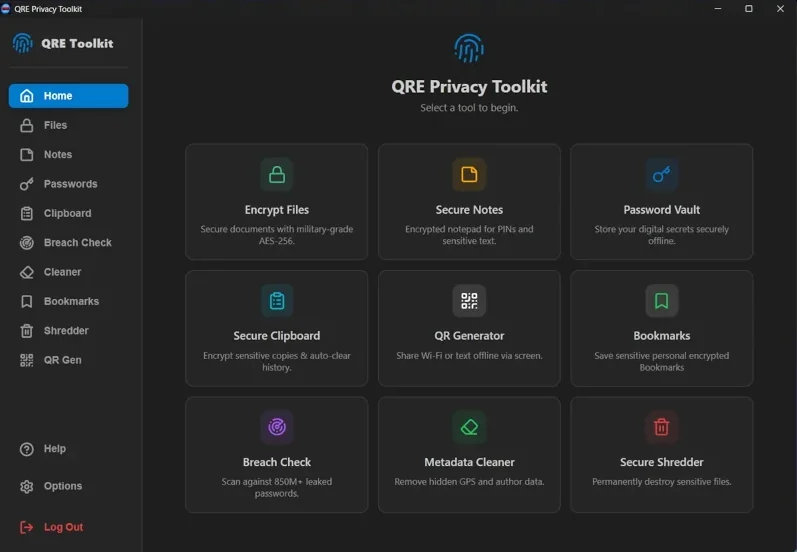

# QRE Privacy Toolkit

**The Local-First Swiss Army Knife for Digital Privacy.**

[](https://github.com/powergr/qre-privacy-toolkit/actions/workflows/build.yml)


QRE Privacy Toolkit is a secure, cross-platform application designed to handle your sensitive data without relying on the cloud. It runs natively on **Windows, macOS, Linux, and Android**.

**[📥 Download the Latest Release](https://github.com/powergr/qre-privacy-toolkit/releases)**

[](https://github.com/sponsors/powergr)

---



---

## 🛠️ The 12-Tool Suite (v2.8.2)

QRE Privacy Toolkit combines 12 essential privacy tools into one mathematically secure, memory-safe application:

### **1. 🔐 File Encryption**

Secure any file—photos, tax documents, 50GB video backups—using military-grade **AES-256-GCM**.

- **Unlimited Size:** Powered by a custom **Rust Streaming Engine**, you can encrypt files of any size without exhausting your RAM.
- **Smart Compression:** Automatically compresses documents while skipping already-compressed media files to save CPU cycles.
- **Cross-Platform:** Lock a file on your PC, unlock it on your Android phone.
- **Time-lock Feature:** Time-Lock Encryption function implemented. Checking the correct time with NTP and ratchet time check.

### **2. 🔑 Password Vault & Offline 2FA**

A secure, offline, zero-knowledge database for your logins.

- **Offline Authenticator (TOTP):** Generate live 6-digit 2FA codes directly inside your vault. No need for cloud-synced authenticator apps on your phone.
- **Generators:** Built-in strong password generator and local strength meter.

### **3. 📝 Secure Notes**

An encrypted notepad for sensitive text that isn't just a password. Store recovery seeds, Wi-Fi codes, or private journals safely at rest.

### **4. 🔖 Private Bookmarks**

Save your sensitive links (Bank logins, Medical portals, Crypto exchanges) in an encrypted vault, completely hidden from browser syncing and forensic tools.

### **5. 📋 Secure Clipboard**

Grabs text from your clipboard, encrypts it into a secure history, and **wipes** the OS clipboard immediately. Auto-clears entries after a customizable TTL.

### **6. 🧹 Metadata Cleaner & Steganography Scan**

A dual-purpose media privacy suite:

- **Meta Cleaner:** Scrub hidden GPS coordinates, camera/device models, and author data from Images (JPG/PNG/WebP/TIFF), PDFs, Office Docs, ZIP archives, Audio (MP3/FLAC/OGG), Video (MP4/MOV), and RAW camera formats (CR2/NEF/ARW/DNG, analysis-only — cleaning is disabled to protect irreplaceable originals). Embedded images (cover art, pasted photos) are scrubbed recursively too, not just the outer file.
- **Steganography Detector:** Two complementary checks on an image's decoded pixel data — a direct plaintext-recovery pass that tries to read a hidden message straight out of each color channel's Least Significant Bits, and a statistical pass that flags a channel/region whose LSB entropy is an outlier relative to the rest of that image, for encrypted or compressed payloads that don't look like readable text.

### **7. 🕵️‍♂️ Local Secret Scanner & Breach Check**

Detect data leaks before they happen, and check if you've already been compromised.

- **Local Scanner:** Rapidly scans unencrypted `.txt`, `.csv`, and `.env` files on your hard drive to find exposed API keys, plaintext passwords, and crypto seed phrases.
- **HIBP API:** Checks if your password has appeared in known data leaks using **k-Anonymity**. We send only the first 5 characters of the hash to the internet.

### **8. ✅ Integrity Checker**

Verify that files you download (like crypto wallets, Linux ISOs, or installers) haven't been tampered with by hackers. Calculates SHA-256, SHA-1, and MD5 simultaneously.

### **9. 🗑️ Secure Shredder (Desktop)**

When you delete a file normally, the data remains on your disk. The Shredder physically overwrites your files with random noise (up to DoD Standard 3-Pass) before deleting them. Includes free-space wiping for HDDs and TRIM commands for SSDs.

### **10. 🔳 Secure QR Generator**

Share sensitive data (Wi-Fi passwords, Crypto addresses) with mobile devices completely offline. Data stays air-gapped on your screen.

### **11. 🧹 System & Registry Clean (Desktop)**

Remove temporary files, browser caches (Chrome, Edge, Brave), Windows Temp, and developer build artifacts (npm, cargo) to free up space. Safely scans and removes orphaned Windows Registry keys.

### **12. 🔎 File Analyzer**

Detects malicious files hiding behind fake extensions (e.g., `salary.pdf.exe`). Analyzes file headers (Magic Numbers) to determine the 'true' file type, ignoring the extension.

---

## 🛡️ Security Architecture

- **Memory Zeroization:** Cryptographic keys and plaintext payloads are actively scrubbed from your system's RAM (`0x00`) the exact moment they are no longer needed, defeating cold-boot attacks and RAM-scrapers.
- **Key Derivation:** Argon2id (Resistant to GPU brute-force attacks).
- **Hybrid Paranoid Mode:** Mitigates theoretical hardware RNG backdoors by XOR-mixing your physical mouse/touch timing jitter directly into the OS's cryptographic seed.
- **Panic Button:** `Ctrl+Shift+Q` instantly kills the app and wipes memory (Desktop).
- **Auto-Lock:** Sessions timeout automatically after inactivity.

---

## 💾 Portable USB Vaults

Transform any standard USB flash drive into a highly secure, cross-platform encrypted vault—no hardware encryption chips required.

- **True Portability:** Initialize a USB drive on your PC, unplug it, and securely unlock your files on any Windows, macOS, or Linux machine running QRE.
- **Multi-Vault Architecture:** QRE’s Rust backend functions as a dynamic Key Manager, securely holding multiple active `MasterKeys` in isolated memory environments simultaneously.
- **Ghost-File Protection (NAND Defense):** Because flash memory hardware uses wear-leveling algorithms that leave deleted plaintext data forensically recoverable, QRE enforces a safe "Encrypt locally, copy securely" workflow, warning you before you encrypt directly on a USB.
- **Sudden Ejection Watcher:** If a malicious actor (or clumsy user) physically yanks the unlocked USB drive out of the machine, a dedicated Rust background thread instantly detects the hardware removal and zeroes the Master Key from RAM.
- **Evil-Maid Verification:** During initialization, a unique Vault UUID is generated. Every time you unlock the drive on a new computer, the UUID is displayed, allowing you to verify out-of-band that an attacker hasn't stealthily swapped your USB's keychain file.

---

## New in v2.8.0

The Steganography Detector has been substantially reworked. It previously measured entropy over an image's raw, on-disk file bytes — since PNG/JPEG/WebP are already compressed formats, that meant nearly any efficiently-compressed photo scored as "suspicious," while the detector had no real ability to distinguish an actual hidden payload from ordinary content. It now works from decoded pixel data instead, and combines two independent techniques:

- **New: direct plaintext recovery.** The scan tries to read an actual hidden message straight out of each color channel's Least Significant Bits (trying both possible bit-packing conventions), rather than only inferring "this looks random." When it finds one, the recovered text is shown directly in the result instead of just a confidence percentage.
- **New: windowed, per-channel statistical analysis.** Replaces the old single whole-image entropy average with a scan that compares each color channel's local entropy against its own baseline across the image. A payload confined to one channel or one region no longer gets diluted into insignificance by the rest of the image, and ordinary detailed photo content (which affects all channels similarly) is far less likely to be mistaken for tampering.
- **New: alpha channel included when present.** Previously always discarded before analysis; some LSB tools hide payloads there specifically since it's the least visually noticeable channel.
- **Fixed:** files that can't be analyzed (an unsupported format, or an image that fails to decode) now show the specific reason why instead of silently vanishing from the scan results with no explanation.
- **Fixed:** a false-positive bug in the plaintext-recovery pass, found during testing — a coincidental run of printable-looking bytes in ordinary image content could be misreported as a 99%-confidence hidden message. The minimum run length required is now derived from the actual scan parameters (targeting roughly 1-in-10,000 odds of a coincidental match) instead of a fixed guess.

Both techniques have real, honest limits worth knowing: they're tuned toward realistically-sized secrets (roughly 20+ characters — most passwords, seed phrases, API keys, and notes), not adversarially tiny test strings, and the statistical pass has only been calibrated against a small number of real images rather than a broad corpus. Treat a "suspicious" result as a strong prompt to investigate further, not an infallible verdict.

## New in v2.7.9

The Metadata Cleaner now covers far more than photos:

- **New formats:** Audio (MP3, FLAC, OGG), Video (MP4/MOV — including the GPS location atom phones embed in recorded video), and RAW camera formats (CR2/NEF/ARW, analysis-only to protect irreplaceable originals).
- **Recursive cleaning:** Cover art embedded in an MP3/FLAC/OGG file, or a photo pasted into a Word/Excel/PowerPoint document, is scrubbed too — not just the outer file's own metadata.
- **Delete cover art entirely (opt-in):** A new "Cover Art / Thumbnails" option removes an embedded picture outright, for when scrubbing its metadata isn't enough.
- **Fixed:** FLAC/OGG author removal now catches arbitrary custom Vorbis comment fields (e.g. `ENCODERSETTINGS`, `SOURCEMEDIA`, `WWWAUDIOFILE`) that batch-tagging tools add — previously only the standard Artist/Comment fields were reliably removed.
- **Fixed:** MP3 cleaning now also detects and cleans APEv2 tags — a second, separate metadata block some tools append after the audio stream alongside ID3v2 — which previously survived a clean untouched.
- **Fixed:** Selecting only "Cover Art / Thumbnails" (with GPS/Author/Date unchecked) no longer silently no-ops as a plain file copy.
- **Fixed:** MP3 files with both an ID3v1 and an APEv2 trailer could end up with one of the two stranded mid-file if they weren't in the conventional order — now removed in a way that's correct regardless of order.
- **Fixed:** the APEv2 tags this tool writes now include a header (not just the mandatory footer), matching what full-featured taggers write by default — a footer-only tag is valid per spec but wasn't reliably recognized by some analysis tools when computing the audio stream's expected size.
- **Increased size limit for audio/video:** MP3, FLAC, OGG, MP4, MOV, CR2, NEF, ARW, and DNG files can now be up to 2GB (up from the 100MB limit shared with images/documents/archives), since large files are normal for those formats.
- **Fixed:** FLAC cover art could survive "Cover Art" cleaning on real-world files. FLAC stores pictures in a native metadata block separate from its tag data, and the underlying tagging library doesn't reliably persist removing that block to disk — now handled with a dedicated, direct fix for that block type.
- **Fixed:** MP4/MOV author/date/description fields (Performer, Album Artist, Description, Recorded Date, etc.) written by mainstream tools (HandBrake, ffmpeg, iTunes) weren't being detected or cleaned at all — those tools use a different, more modern metadata structure than the one this tool originally supported. Title, Genre, and the encoding-tool name are still kept, matching this tool's policy for non-identifying fields.
- **Registry Backup retention:** old registry backups (System Clean tool) are now automatically pruned, keeping only the 10 most recent, so repeated use doesn't leave an ever-growing pile of files behind.
- **Fixed:** cleaning a PDF's XMP metadata could leave the document catalog pointing at the now-deleted metadata stream (a dangling reference some readers flag, e.g. exiftool's "Bad Metadata reference") and, for large real-world documents, produce a noticeably _larger_ file than the original since the rewrite wasn't recompressing streams or using compact object/cross-reference streams. Both fixed.
- **Fixed:** Word's "Total Edit Time" field (`docProps/app.xml`'s `TotalTime`) survived Office document cleaning — it wasn't on the removal list alongside Application/Company/Manager/Template.
- **New RAW format:** Adobe DNG is now supported (analysis-only, same policy as CR2/NEF/ARW — cleaning is disabled to protect irreplaceable originals).
- MP4/MOV support is a small, purpose-built parser (no general-purpose crate exposes the GPS atom), designed to only ever redact bytes in place and never resize or rewrite the container, to minimize risk to video files.

## New in v2.7.8

- **Fixed:** Encrypting a file no longer bounces the file explorer back to the Drives view — it now correctly stays in the folder you were working in.
- **Fixed:** The keychain backup reminder now re-arms itself after you change your Master Password or reset your Recovery Code, so you're prompted to save a fresh backup instead of being silently skipped forever.
- **Fixed:** Error dialogs (wrong password, failed operations) no longer display a misleading green "Success" state, and can now be dismissed with Enter/Escape as well as the mouse.
- **Security:** Patched a HIGH severity (CVSS 7.5) denial-of-service vulnerability in the PDF library used by the Metadata Cleaner ([RUSTSEC-2026-0187](https://rustsec.org/advisories/RUSTSEC-2026-0187.html)) — a maliciously crafted PDF could previously crash the app.
- **Maintenance:** Updated numerous Rust and npm dependencies to their latest stable versions; re-enabled and fixed the automated fuzz-testing CI workflow.

Also see: Time-Lock Encryption, added in v2.7.6. Read more in the [Time-lock blog post](https://powergr.github.io/privacy_toolkit/blog-timelock-encryption.html).

---

## 🔮 What's Next

A few larger Rust dependency upgrades are intentionally being held back for a dedicated, more careful pass rather than bundled in with routine updates, since they touch core cryptography and the `.qre` file format directly:

- **`bincode`** (1.x → 3.x) — serializes the `.qre` container format itself; needs verified round-trip compatibility with files already encrypted by earlier versions before upgrading.
- **`rand` / `rand_chacha`** (0.9 → 0.10) — used for entropy and nonce generation during encryption.
- **`sha2` / `sha1` / `md-5`** (0.10 → 0.11) — used in key-wrapping and the Integrity Checker.
- **`zip`** (2.x → 8.x) — large multi-major jump, used for zip-bomb-guarded Office document metadata cleaning.

### Dependency audit notes (2026-08-18)

`Cargo.lock` currently resolves ~706 packages, with ~45 crate names present in 2 (occasionally 3) versions at once. Investigated which of these are actually prunable:

- **Not prunable — unavoidable ecosystem skew.** Most duplicates (`windows`/`windows-core`, `reqwest`, `toml`, `indexmap`, `hashbrown`, `syn`, `thiserror`, `getrandom`, `winnow`, etc.) come from transitive major-version conflicts between Tauri's own plugins and their sub-dependencies (e.g. `winreg` wanting an older `windows` than `tao`/`muda`/`arboard`). Cargo already collapses everything semver allows; what's left can't be removed without upstream crates converging.
- **The held-back list above is already duplicated today.** `lopdf` (PDF metadata cleaning) already pulls `rand` 0.10, `sha2`/`sha1`/`md-5` 0.11, and `tauri-plugin-updater` already pulls `zip` 4.6 (not 8.x — that target has moved since the note above was written) regardless of the older versions this crate pins directly. So both old and new copies of these four crates are compiled into the binary _right now_ — holding back our own pin isn't avoiding the newer major version, it's just adding a second copy alongside it. Doing the compatibility pass would remove ~4-5 duplicate crates instead of only being a version bump. `bincode` is the exception: nothing else in the tree needs `bincode` 3.x, so that pin is still genuinely holding back a version.
- **Checked for redundant direct dependencies — none found.** `id3` + `lofty` + `ape` look like three overlapping audio-tag libraries, but each covers a gap the others don't handle correctly (see the APEv2 header/footer and ID3v1/APEv2 ordering fixes in the v2.7.9 notes above) — removing any one breaks real, tested behavior in `cleaner/media/mp3.rs`. Likewise `reqwest` (direct backend HTTP client in `breach.rs`, for HIBP/IP checks) and `tauri-plugin-http` (frontend CORS-bypass `fetch`, used by the Android update checker) look redundant by name but serve different halves of the app.
- Android build warnings about unused functions (`wipe_free_space`, `trim_drive`, etc.) are false alarms — those are `#[cfg(not(target_os = "android"))]`-gated desktop-only code, correctly unreachable when cross-compiling for Android.

---

## 🚀 Getting Started & Building

```bash
# 1. Install Dependencies
npm install

# 2. Run in Dev Mode
npm run tauri dev

# 3. Build for Release
npm run tauri build
```

## ⚠️ Important Security Notice

QRE Privacy Toolkit follows a strict **Zero-Knowledge** architecture. If you lose your **Master Password** AND your **Recovery Code**, your data is mathematically inaccessible. There is no "Password Reset" button because there is no server. **Backup your `keychain.json` file safely.**

---

## ✅ Test Coverage

QRE Privacy Toolkit maintains rigorous, automated cryptographic and UI testing to guarantee safety across updates.

**Rust Backend (`cargo test`):**

- 367 tests passed from 345 total (Covers memory wiping, file routing, steganography detection, Zip-Bomb prevention, AES-GCM streaming integrity, and metadata-cleaner round-trips across every supported file format).

**Frontend (`npm test`):**

- 187 tests passed from 185 total (Jest suite covering UI state, ReDoS-safe regex heuristic parsing, and password strength algorithm boundaries).

---

**License:** MIT | **Copyright:** © 2026 Project QRE Privacy Toolkit

---
